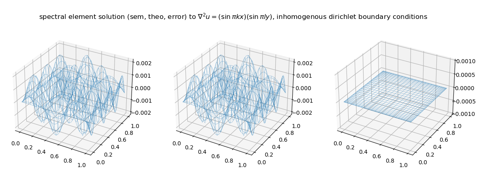
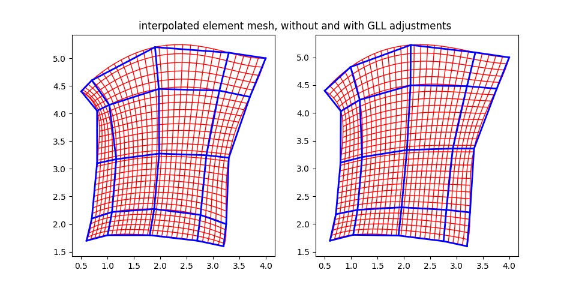
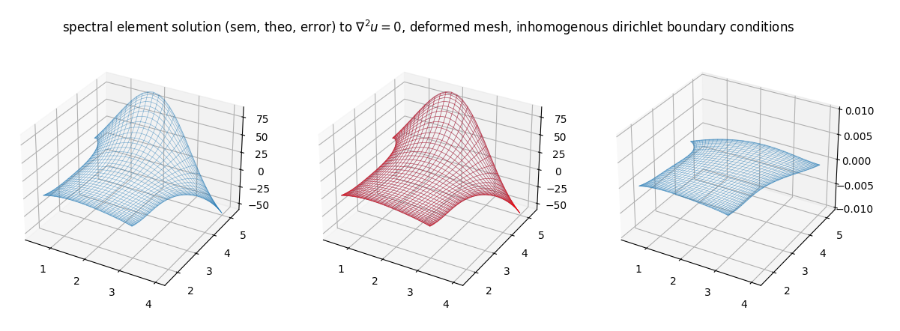

# Spectral Elements for PDEs

This repository has codes for solving Poisson and Laplace equations on undeformed and deformed domains (implemented in Python and MATLAB). Clone this repository to run codes (use [GNU Octave](https://octave.org/) if MATLAB is not available, and use [NumPy](https://numpy.org/), [SciPy](https://scipy.org/), and [Matplotlib](https://matplotlib.org/) for Python codes).

## example: Poisson on an Undeformed Element (inhomogenous Dirichlet boundary conditions)
Here, we see the computational solution, the theoretical solution, and the difference between the two to the Poisson PDE with prescribed Dirichlet boundary conditions and a given RHS.

## example: Laplace to Create a Better Deformed Mesh
Here, we redistribute our external nodes to be redistributed by arc length according to a Gauss-Lobatto-Legendre distribution, and we use the solutions to the Laplace equation to blend the X and Y boundary data into the rest of the domain (internal blue nodes) and interpolate on these nodes to create a continuous mesh of any degree (red nodes).

## example: Laplace on a Deformed Mesh
Here, we can then build modified differentiation, mass, and stiffness matrices to solve Laplace on a deformed GLL mesh.

